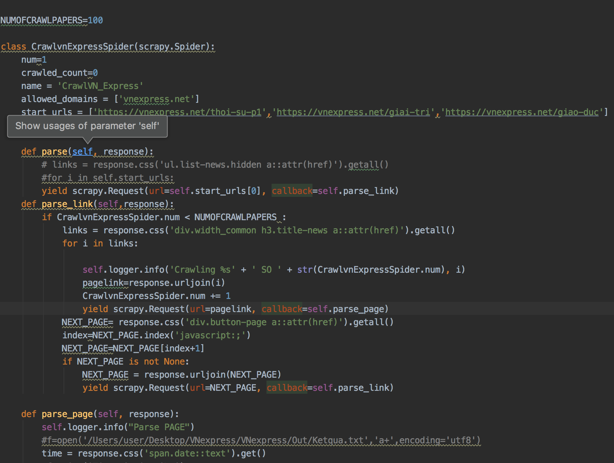
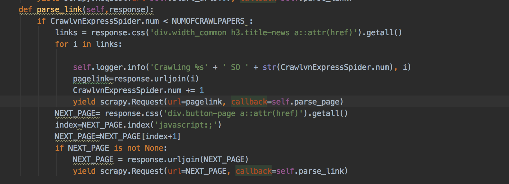
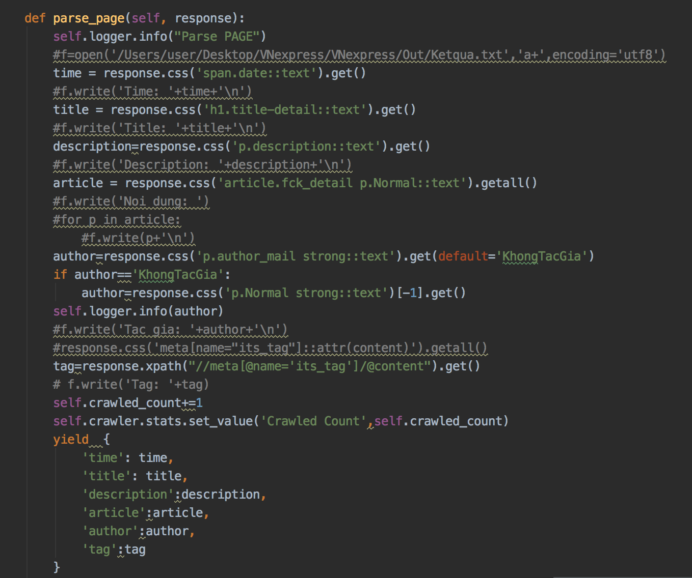

# TanLeNghia_18020949_Nhom4_Crawler
# Crawl Báo VN_EXPRESS

## Mô tả
File source code chính : CrawlVN_Express.py

Trong đó có ba hàm : parse , parse_link và parse_page

### parse : 
Khởi tạo request tới link start_url

### parse_link :

Trích xuất các link để tiếp tục lan ra 
Với links là danh sách đường dẫn các bài báo trích xuất ra được trong trang chủ và for i in links để tiếp tục tới parse_page với callback=parse_page để phân tích kĩ hơn lấy nội dung  
Với next_page là chuyển sang một trang chủ mới để tiếp tục callback=parse_link để trích xuất các links báo mới

### parse_page :  

Phân tích cụ thể một trang báo 
Với các nội dung lấy được như : 
+ 'time':thời gian
+ 'title':tiêu đề 
+ 'description':mô tả 
+ 'article':nội dung bài báo
+ 'tags':tags
+ 'author':tác giả

## Kết quả thu được
[Out](https://github.com/LENGHIA-CN8/TanLeNghia_18020949_Nhom4_Crawler/tree/master/VNexpress/spiders/Out.json)
